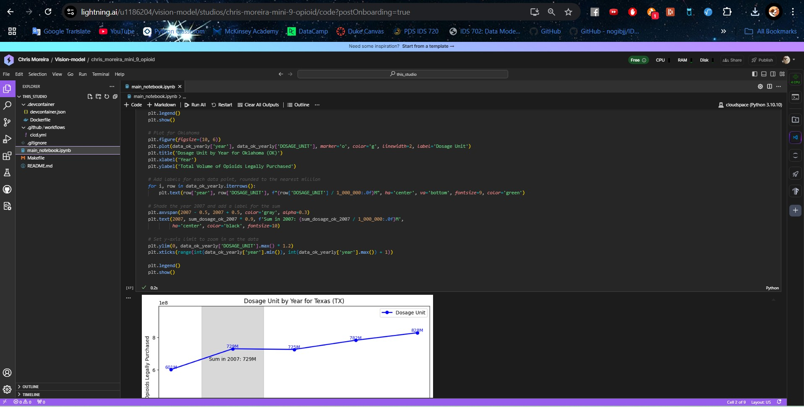
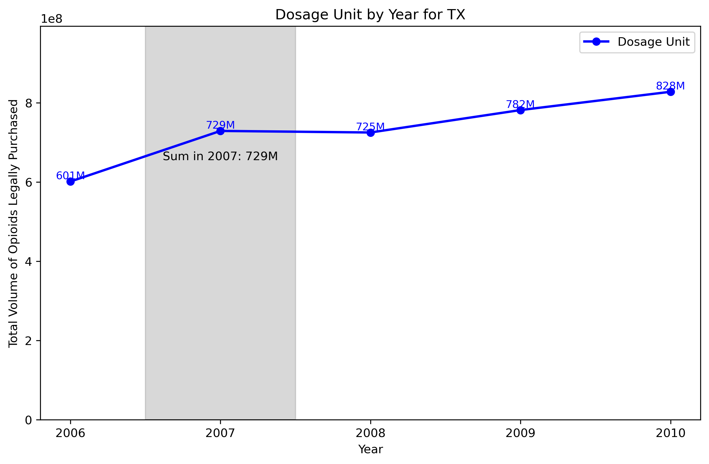
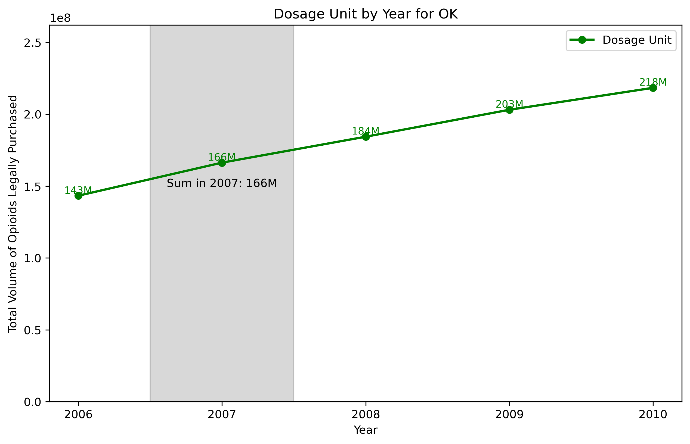
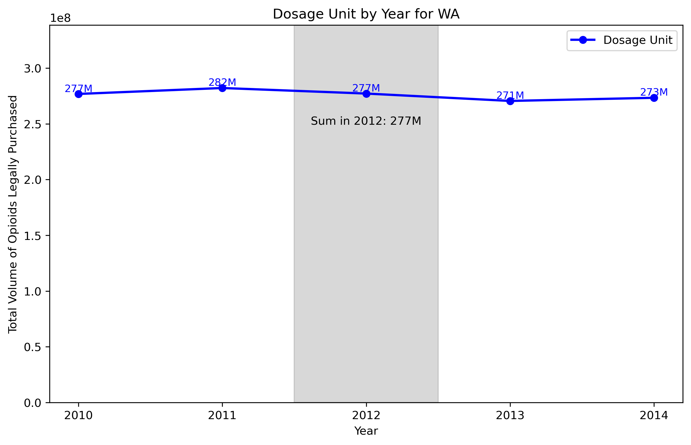
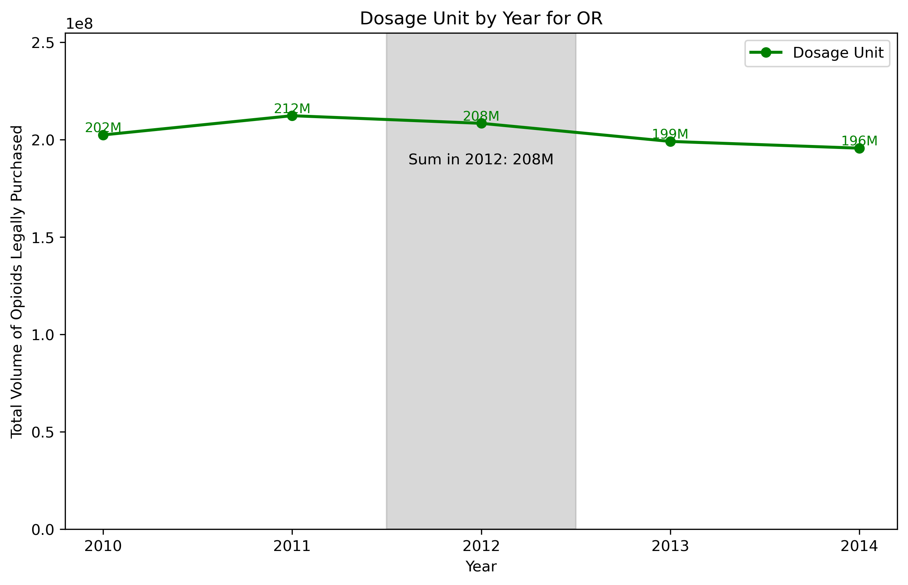
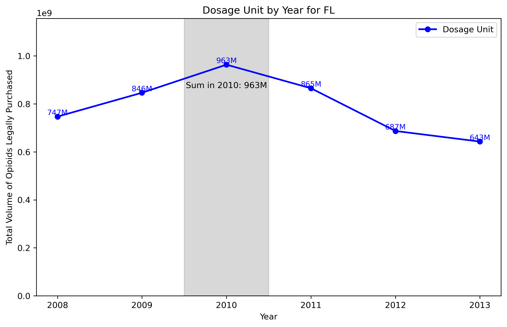
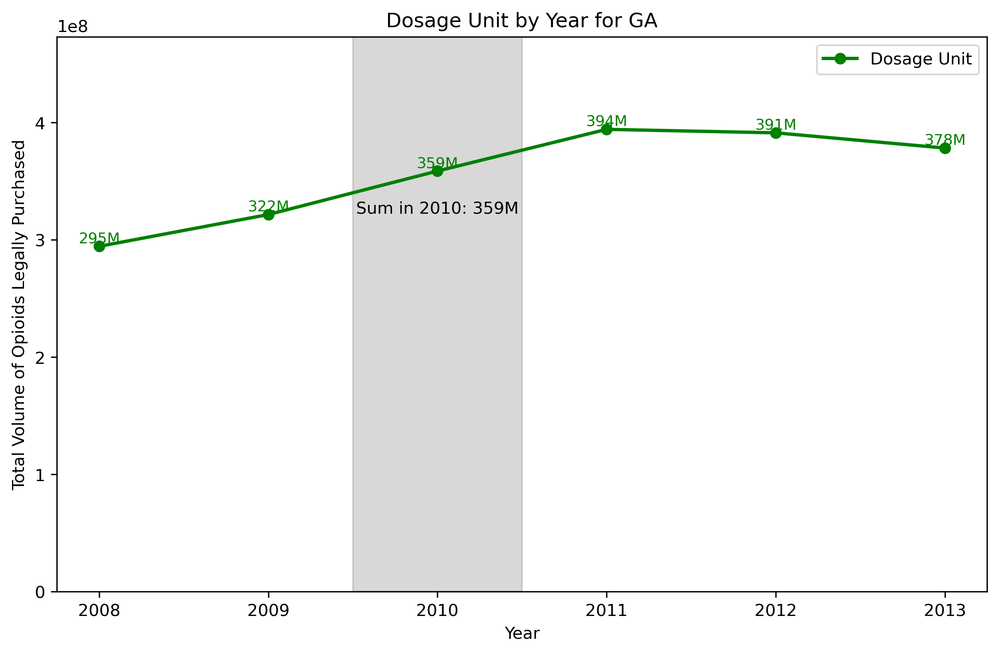

# Week 9 - Cloud Based Notebook - Assessing the Effect of Policy on Opioid Volume

# PROJECT BADGES
Install:

Lint:

Test:

# Schema of Repository Files

# PROJECT DESCRIPTION
In this project, we analyze opioid dosage shipments across different U.S. states to explore the impact of state-level opioid regulations. The analysis was conducted using a cloud-based notebook environment on Lightning AI, which integrates the VS Code interface into its cloud infrastructure. A key advantage of Lightning AI over other platforms (such as Google Colab) is its ability to run a terminal for free, providing additional flexibility for managing dependencies and project files.

Below is a snapshot of the Lightning AI interface:

### Analysis Overview
This data analysis investigates the effect of opioid regulations on the volume of opioid shipments in states where these regulations were implemented. The primary states we examined for regulatory impact are:

- **Texas**
- **Washington**
- **Florida**

To provide a meaningful comparison, we selected adjacent or similar states without such regulations during the same period:

- **Oklahoma** (comparison state for Texas)
- **Oregon** (comparison state for Washington)
- **Georgia** (comparison state for Florida)

### Key Findings

Our analysis yields the following insights:

- **Florida**: The regulation adopted by Florida in 2010 appears to have been particularly effective, as there is a significant reduction in opioid shipment volumes in the years following its implementation. This finding suggests a strong regulatory impact on curbing opioid shipments in the state.

- **Washington**: In contrast, the regulation implemented in Washington did not show a noticeable effect based on the observed data. Both Washington and the comparison state, Oregon, exhibited similar trends in opioid shipment volumes. For future analysis, it may be worthwhile to compare Washington with a different state that displays a distinct trend from Washington's pattern.

- **Texas**: In Texas, we observe a reduction in opioid shipments after the regulatory measures were put in place. This decrease deviates from the trend seen in Oklahoma, indicating a likely regulatory impact in Texas.

### Conclusion
This project demonstrates how state-level regulations can vary in effectiveness depending on the state and the broader context. While regulations in Florida and Texas appear to have been effective in reducing opioid shipments, Washington’s regulation did not show a similar impact. These results highlight the need for further analysis to understand the nuances behind these differing outcomes, such as exploring additional comparison states or analyzing other factors that might influence opioid shipments.

# Charts
Texas  

Oklahoma  

Washington  

Oregon  

Florida  

Georgia  

